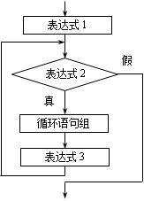

# c++基础：

# C++概述

- 程序设计语言的发展经历了三个阶段，C++属于高级语言

  - 机器语言

    

    - 有计算机可以直接识别的"0"，"1"组成的指令码，通过读取设备督导计算机内部。

  - 汇编语言

    - 使用助记符代替二进制0，1，例如：add表示加法，sub表示减法，mov表示移动。

    - 计算机不能直接识别，需要转换为机器语言。

  - 高级语言

    - 更接近人类自然语言，例如：a = 10+20。

    - 计算机不能直接识别，需要转换为机器语言。

# 初识C++

- C++是在C语言的基础上发展而来的，面向对象的高级程序设计语言。

- C++98和11是两个常用标准：

  - C++ 98标准： C++标准第一版，于1998年发布

  - C++ 03标准： C++标准第二版，于2003年发布

  - C++11标准：C++标准第三版，于2003年发布

  - C++1４标准：C++标准第四版，于2014年发布

  - C++17标准：C++标准第五版，于2017年发布

# Ｃ++语言的特点

- 继承Ｃ语言的优点：语言简洁紧凑，语法结构明确，拥有丰富的运算符和数据结构，程序执行效率高，可移植性好。

- 即是面向过程的语言也是面向对象的语言，且以面向对象为主。

- C++可复用性高，支持以模板为特征的泛型编程。

- C++是编译型语言。

# C++语言的应用领域

- 并发要求高的网络服务器端

- 用户体验要求高的PC客户端，杀毒软件等。

- 操作系统，高级语言的运行环境。

- 图形图像处理，虚拟现实。

- 设备驱动，嵌入式和硬件相关。

# C++程序在Visual studio的主要概念：

解决方案，项目，程序文件：

- 一个解决方案可以有一个或多个项目，一个项目可以有一个或多个文件

# 语法基础

## 注释

- 注释是说明性的文字，用来说明程序的功能，便于他人读懂程序，不执行。

## 基本语法

- 用#include 引入库文件；

- 一行代码只做一件事，每行语句末尾加分号；

- 所有缩进是4个空格；

- {}之内的代码块在{按级缩进对齐

- 程序的分界符“{”和“}”应独占一行并位于同一列，同时于引用他们的语句左对齐。

## 关键字

- 由程序本身使用的，有专门的意义和用途。

## 标识符

- 标识符就是名字：函数名，变量名，类名，对象名等

- 标识符命名规则：

  - 不能使用C++关键字作为标识符。

  - 大小写敏感。

  - 只能由字母、数字、下划线组成，且不能以数字开头。尽量不要使用下划线开头。

  - 标识符要见名知意。

- 标识符命名规范：

  - 普通变量（函数内的变量）命名：类型缩写+单词（首字母大写），例如：nAge，sName。

  - 类的成员变量命名：m_类型缩写+单词（首字母大写），例如：m_nAge，m_sName。

  - 全局变量命名：g_类型缩写+单词（首字母大写），例如：g_nAge，g_sName。

  - 常量命名：全大写，用下划线分割单词。例如：MAX_LENGTH。

  - 函数名：动词+名词组成，第一个单词全部小写，其他单词首字母大写。例如：getAge()，setName()。

  - 函数名：多个单词组成，每个单词首字母大写。例如：StudentInfo。

## 变量

- 变量是命名的其值可以改变的量，变量作用是保存数据。

- 一个变量有三个要素：类型、变量名和值。

- 变量的三种初始化方式：

  - 传统i初始化方式

  - 对象方式初始化方式

  - C++11标准，统一初始化方式

- 定义变量的注意事项

  - 变量使用前必须定义，确定变量名、类型及初值；

  - 变量类型可以是C++支持的所有类型，包括基本类型和自定义类型；

  - 同一个作用域不能定义相同名称的变量。

  - 变量定义时系统会根据类型分配相应大小的内存空间，如果时自定义类型，则会执行相应的构造函数。

  - 相同类型的多个变量可以在一个语句中定义，变量名用逗号分隔。

## 常量

- 在程序运行过程中，其值不能改变的量称为常量。C++中常量分为直接常量和符号常量（命名常量）。

- 直接常量：直接使用数字或文字表示的值。

- 符号常量：使用标识符表示数值或文字，符号常量只能在定义时指定其值，一旦初始化后不能用复制语句修改。符号常量有两种定义方式：

  - 使用宏定义： #define 宏名 值

  - 使用const定义：const 类型 常量名 = 常量值。

## 输入和输出

- 输入cin

- 输出cout

## 基本数据类型

### 整数型

- 有符号

- 无符号

  

### 浮点型

- float，4字节
- double，8字节

### 字符型

- char 字符型，1字节，用于存放一个字符。
- char取值范围：-128~127；unsigned char取值范围：0~255
- ASCII编码：
  - 英文包括各种符号在及全集存储时，对符号进行编码，ASCII码时英文符号和数字编号的
- ASCII码表：

### 布尔型

- bool布尔型，1字节，取值只能由true（真）或false（假）
- 数字0，空字符‘\0’, 代表假
- 任何非0数字，非空字符串，代表真。

# 运算符与表达式

## 算术运算符

- 基本算术运算符：+加，-减，*乘，/除，取余%

- 自增自减运算符：

  - ++使变量自身增加1。

  - --使变量自身减少1。

  - ++(--)在前，先算后用；++(--)在后，先用后算。

## 赋值运算符

- 给变量赋值： = 

- 复合运算符：+=、-=、*=、/=、%=

## 关系运算符

- <, <=, ==, !=, >,>=

- 关系运算符的结果是布尔值。

## 逻辑运算符

- !逻辑非，||逻辑或，&&逻辑与

- 逻辑短路

  - 短路求值是指&&和||都是先求左侧表达式的值，当左侧表达式结果无法确定逻辑运算结果时，才计算右侧表达式的值。

  - A&&B，当A的结果为false时，不计算B；A||B，当A的结果为true时，不计算B。

## 其他运算符

### 条件运算符：

- 格式：表达式1?表达式2：表达式3; 

- 当表达式1的结果为true，取表达式2的值，否则取表达式3的值。

### 逗号运算符：

- 逗号即是标点符号，也是运算符，其优先级最低，

- 一个逗号运算符可将两个表达式连接起来，多个逗号可连接多个表达式。

## 运算符优先级

- 单目运算符，如：自增，自减等

- 双目运算符，如：加，减等

- 三目运算符， 如：条件运算符

# 控制结构

- 任何复杂程序都是由三种基本机构组成：顺序结构，分支结构，循环结构。

## 分支结构

- ### 	单分支

- ### 	双分支

- ### 	多分支	

#### if多分枝

#### switch多分枝

#### if与switch多分枝的区别

## 循环结构

- for语句，while语句与do while语句的比较

  - for语句比较适合于循环次数固定的场景

  - while语句与do while语句比较合适循环次数不固定，且循环结束条件比较明确的场景。

  - do while 语句与while语句的区别是： while先判断循环条件，再执行循环体语句，而do while先执行循环体一句，再判断循环条件。

### for循环

- 表达式1，一般用于为循环变量赋初值

- 表达式2为循环条件，若表达式2为真，则执行循环体中的语句，否则退出循环。

- 表达式3， 一般用于改变循环变量，使循环结束。

### while循环

### do while循环

- do while的循环体至少执行一次

### 跳转语句

- continue语句：结束本轮循环，进入下一轮循环。

- break语句： 结束整个循环，转向循环语句下面的语句继续执行。 

# 面向过程编程POP（Procedure Oriented Programming）

## 概念

- 面向过程变成以功能为中心，专注以问题的解决，将整个需求给拆分成若干个步骤，每个步骤定义一个函数，逐步调用函数来完成最终实现。

- POP以函数为最小单位，强调的是功能行为。

## 举例：

张三开TESLA车去上班

- 打开TESLA车门

- 进入TESLA车内

- 关闭TESLA车门，系好安全带

- 启动TESLA

- 驾驶TESLA

- 停止TESLA

## 优点：

特别符合人类的思维，各个代码分工明确。

## 缺点：

只能适用于特定的场景，通用型和可拓展性不好。

# 面向对象编程OOP（Object Oriented Programming）

## 概念

- 面向对象编程考虑的核心不是如何逐步实现需求，而是将整个需求里面涉及到的事物找出来，将事物的数据抽象成属性，将行为抽象为方法。这些方法和属性构成类，这些类之间相互协调完成需求。

- 面向对象编程的最小单位是类

- 面向对象 = 类 + 对象 + 继承 + 多态 + 消息（对象调用属性和方法），其中类和对象是核心。

## 举例：

张三开车去上班

- 将其中的张三抽象为人类

  - 属性：姓名、性别、年龄、身份证号

  - 行为：打开车门()、关闭车门()、驾驶车辆()

- 将其中TESLA抽象为车类

  - 属性：型号、品牌、颜色、车架号、车牌

  - 行为：启动运行()、停止运行()

# 类的基本使用

## 类的定义

## 语法

- class类的定义的关键字，后面直接写类名

- 类名是一个标识符，一般要求首字母要大写，其他字母小写

- 花括号表示类的作用域，也叫做类体

- 分号表示类的结束

- private私有权限（类内访问），protected是保护权限（本类和子类可以访问），public（类外可以访问）是公有权限，可以决定成员在类外的可见性

- 类中成员函数（方法）一般在类中进行声明，在类外来进行定义。

## 属性和方法定义的注意点

- 属性的类型可以是任意类型，如果是数组类型要求必须有大小。

- 多个数据成员名称不可以冲突，一个类是一个作用域，同一个作用域中不能出现相同名称的变量名

- 一个类中可以有多个成员函数重载，即函数名相同，但是形参个数或者类型不同

- 类的成员函数可以有默认值

## 创建对象的方式

- 类名 对象名（一般创建对象）

- 类名* 指针名 = new 类名;（使用动态空间开辟的方式创建对象，记得释放）

## 类和对象的关系

- 类域对象是抽象和具体的关系，类是创建对象的模板，在程序运行的时候，类是静态，不能改变，对象是动态的，会根据自己的创建情况来决定自己的生命周期，我们一般将对对象的创建叫做类的实例化过程过。

## 类中的特殊成员

- 类的成员除了普通的数据成员和成员函数，也包括构造函数、析构函数、拷贝构造函数等等，这些函数为支持对象生命周期，从创建开始，调用函数操作对象，然后被对象给释放，结束生命周期。

### 构造函数

#### 概念

- 在定义变量的时候可以为变量提供初始值，同样在创建对象的时候也可以为对象的属性提供初始化，也就是对象的初始化，C++提供了构造函数来完成这个操作。

#### 特点

- 1、构造函数的函数名和类名完全相同

- 2、不能定义构造函数的类型

- 3、构造函数应该声明为公有权限

- 4、构造函数不需要手动调用，会在创建对象的时候自动调用

#### 注意点：

- 1、构造函数可以重载，编译器会根据实际实参决定到底调用哪一个构造函数

- 2、如果类中没有显示声明构造函数，C++编译器会自动生成一个默认的构造函数，没有参数，一旦用户手动声明，默认的构造函数就不再生成了

- 3、无参默认构造函数结构体：Rect::Rect(){}

- 4、无论以什么样的方式来定义对象，都会调用构造函数，如果编译器找不到匹配的构造函数，就编译报错。一般为了让对象能实现多种形式的初始化，可以为类定义多个不同参数的构造函数。

### 析构函数

#### 概念

- 和变量一样，函数中定义的局部变量，当程序离开函数的时候，变量就消失，由于类中数据成员可能有指针，对象中就可能出现动态分配的内存，就需要在析构函数中，将动态内存给释放掉，也就是在对象消失之前（析构函数就是在对象消失之前被自动调用）

#### 析构函数特点

- 析构函数的名字要以"~"开头

- 析构函数没有参数，也没有返回值

- 一个类中只有一个析构函数，不能重载

- 当一个对象消失的时候，编译器会自动调用析构函数

- 如果没有显示定义析构函数，编译器会自动生成一个公有的析构函数，函数体为空

#### 主要作用：

在删除一个对象之前被调用，释放该对象成员的内存空间以及一些其他的清理工作（例如：关闭文件、关闭数据库链接）

### 拷贝构造函数

#### 概念

- 创建一个对象可以直接创建出来，也可以由一个已有的同类对象复制而来，即克隆一个对象，后者需要调用拷贝构造函数。

#### 特点：

- 定义方式：类名 (const 类名& 对象名);

- 函数的形参必须为常引用

- 必须通过已有对象创建新对象

#### 拷贝构造函数的形参为什么一定要写成常引用

- 常引用在接受原对象的时候，拿到的是源对象本身，如果不写引用，会创建一个临时对象会消耗资源，为了避免实参的值被修改，所以要将参数声明为const类型，这样在拷贝的时候既减少了资源的消耗，也阻止了对源对象的修改。

# 类的三大特性

## 封装性

- 封装就是将现实生活中的事物定义为类，事物的数据抽象为属性，行为抽象为方法，应该为每一个属性都定义两个方法（get方法和set方法），也应该包含构造函数和析构函数等内容。

## 继承性

- 继承性是面向对象的中重要特征之一，定义类的时候可以从现有的类继承下来，被继承的类叫做父类、基类或者超类，新定义的类叫做子类或者派生类。子类继承了父类的属性和方法，可以实现代码的复用，子类中就不需要再定义父类中已经有的属性和方法，只需要定义父类中没有的，子类需要新增的属性和方法即可。

### 图示

- 单继承：子类只有一个父类

- 多继承：子类有多于一个的父类

- 直接基类：教师类是教师管理人员类的直接基类

- 间接基类：人类是教师管理人员类的间接基类

### 派生类的定义方式

#### 单继承定义

#### 类中的成员权限的区别

- 私有权限：类中可以使用，类外和子类都不能使用

- 保护权限：类中、子类可以使用，类外不可以使用

- 公有权限：类中、子类、类外都可以使用

#### 综合实例

- 定义一个Animal类，属性有姓名和年龄，方法有构造方法、跑、叫和getName()方法

- 以Animal为基类，定义子类Cat，Cat继承父类的属性和方法

- 定义另外一个子类Dog类，Dog除了继承父类的属性和方法以外，增加一个属性是dogType代表类型，增加一个方法叫做lookHouse()

- 需要创建不同的文件

  - Animal.h
  - 

  - Animal.cpp

    

  - Cat.h

    

  - Cat.cpp

    

  - Dog.h

    

  - Dog.cpp

    

  - main.cpp

    

### 不同的继承方式对于成员权限的影响

#### 公有继承

- 父类中的私有成员子类中不可访问

- 父类中的保护成员在子类中还是保护成员

- 父类中的公有成员在子类中还是公有成员

#### 保护继承

- 父类中的私有成员子类中不可访问

- 父类中的保护成员在子类中还是保护成员

- 父类中的公有成员在子类中变为保护成员

#### 私有继承

- 父类中的私有成员子类不可以访问

- 父类中的保护成员和公有成员全部变为私有成员

### 派生类的构造过程

- 由于派生类继承了基类的成员，派生类的对象既包含本身的数据成员，也包括基类继承的数据成员，在构造派生类的时候要优先构造基类，由于构造函数是不能被继承的，所以要求子类要通过构造函数为父类的构造函数传参。

- 派生类的构造顺序

  - 1、调用基类的构造函数

  - 2、按照数据成员（包括内嵌对象、常量、引用等等）的声明顺序依次调用数据成员的构造函数或者初始化数据成员

  - 3、执行派生类的构造函数

- 基本语法

### 派生类的析构过程

- 1、执行派生类的析构函数

- 2、按照内嵌对象声明的相反顺序依次调用内嵌对象的析构函数

- 3、调用基类的析构函数

### 多继承简介

- 一个派生类有多于一个的基类，称之为多继承，多继承比较复杂繁琐，尽量避免使用。

- 构造顺序

  - 按照声明顺序（从左至右）依次调用基类的构造函数

  - 然后按照数据成员（包括内嵌对象，引用，常量等等）的声明顺序依次调用数据成员的构造函数或者初始化数据

  - 执行派生类自己的构造函数

- 析构顺序

  - 执行派生类自己的析构函数

  - 然后按照数据成员声明的相反顺序依次调用各个数据成员的析构函数

  - 按照基类声明的相反顺序依次调用各个基类的析构函数

## 多态性

- 一般指的是一个事物的多种形态，C++语言中多态性分为编译时的静态动态和运行的时的动态多态，后者主要通过继承和虚函数来实现。

- 父类指针指向子类对象是可以的，但是无法直接调用子类的成员函数，必须依赖虚函数才能用父类指针调用子类对象的函数

### 虚函数定义方式

- virtual 函数类型 函数名(参数表);

- 注意点：

  - 父类有虚函数，子类中的同名函数会自动成为虚函数，子类中的同名函数可以加virtual也可以不加。

  - 虚函数在声明的时候需要加virtual关键字，类外定义的时候是不能写virtual的

- C++运行时的多态主要目的：可以通过基类指针来直接访问所有派生类（包括直接派生和间接派生）的成员函数，对其进行全方位的访问，在不同的继承关系中，调用同一个函数，能够产生不同的行为。

### 基于虚函数实现运行时的多态需要满足的条件

- 基类中定义了虚函数

- 子类中重写了父类的虚函数

- 用基类指针来调用子类对象并且使用这个虚函数

### 虚函数实现动态多态的机制

#### 图示

- 编译器为每个包含虚函数的类创建一个虚函数表，并且为每一个对象创建一个虚函数指针（虚指针）指向这个类的虚函数表，使用基类指针对虚函数调用的时候，其实通过这个虚指针，在虚函数表中查找相应的虚函数地址，从而完成调用。

### 虚析构

- 如果基类指针指向派生类的对象，当调用delete释放对象的时候，如果父类的析构函数不是虚函数，那么就无法用基类指针调用子类的析构函数，所以就会导致子类动态申请的空间无法被释放，所以基类需要将析构函数定义为虚函数，就可以将父子类中析构函数都进行调用，空间都可以进行释放。

### 纯虚函数和抽象类

- 纯虚函数是没有函数体的特殊虚函数，主要的目的是为了给程序提供统一的接口，具体的定义由子类来完成。

- 声明方式：virtual 函数类型 函数名(参数表) = 0;

- 声明纯虚函数之后，不写函数定义，有纯虚函数的类叫做抽象类，通常作为派生类的基类来使用，但是如果派生类继承了抽象类的虚函数，但是没有定义，那么派生类也会自动成为抽象类，除非当前类已经将继承下来的抽象类中纯虚函数全部定义，或者当前派生类自己有新的虚函数，也已被定义，否则就是抽象类。

### 重载、重写和覆盖的区别

- 重载：通过函数的形参类型或者个数不同，来定义多个同名函数实现一个函数名根据形参不同调用不同的函数，实现不同的结果。

- 重写：如果父类有虚函数，子类将父类的虚函数重新定义，就是函数的重写。

- 覆盖：父类和子类有相同名称的函数，父类的函数不是虚函数，就叫做覆盖。

- C++11中的关键字

  - override：可以检测当前的函数是否是继承下来的虚函数

  - final：表示某个虚函数已经是最终版本，子类不能再进行重写
