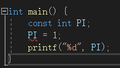

# 嵌入式学习 DAY2

## 常量：


1、 包括**整数常量**、**浮点常量**、**字符常量**等，不可被赋值运算符更改。

**字符常量**：使用单引号’，‘a’

**字符串常量**：使用双引号”，“asdf”

字符串字面量不能直接和字符字面量直接比较。

2、在 C 中，有两种简单的定义常量的方式：

    使用 #define 预处理器： #define 可以在程序中定义一个常量，它在编译时会被替换为其对应的值。

    使用 const 关键字：const 关键字用于声明一个只读变量，即该变量的值不能在程序运行时修改。
**注：const声明常量需要在一个语句中完成。**




### #define 与 const 区别
#define 与 const 这两种方式都可以用来定义常量，选择哪种方式取决于具体的需求和编程习惯。通常情况下，建议使用 const 关键字来定义常量，因为它具有类型检查和作用域的优势，而 #define 仅进行简单的文本替换，可能会导致一些意外的问题。

#define 预处理指令和 const 关键字在定义常量时有一些区别：

**替换机制**：#define 是进行简单的文本替换，而 const 是声明一个具有类型的常量。#define 定义的常量在编译时会被直接替换为其对应的值，而 const 定义的常量在程序运行时会分配内存，并且具有类型信息。

**类型检查**：#define 不进行类型检查，因为它只是进行简单的文本替换。而 const 定义的常量具有类型信息，编译器可以对其进行类型检查。这可以帮助捕获一些潜在的类型错误。

**作用域**：#define 定义的常量没有作用域限制，它在定义之后的整个代码中都有效。而 const 定义的常量具有块级作用域，只在其定义所在的作用域内有效。

**调试和符号表**：使用 #define 定义的常量在符号表中不会有相应的条目，因为它只是进行文本替换。而使用 const 定义的常量会在符号表中有相应的条目，有助于调试和可读性。

### 浮点类型：
double和lfloat

float精确范围：7位有效数字

double精确范围：15~16位有效数字

## 字符型：
ASCII码表：


### 不可见字符【0-32】、【127】：灰色部分
### 可见字符：
        数字字符【48-57】

        大写字母【65-90】

        小写字母【97-122】

        注：大小写字母差值为32，大写字母数值较小。

### 转义字符：
转义字符可以将一些具有特殊含义的字符转化为普通字符使用，或者也可以将一些普通字符转化为具有特殊含义的字符来使用
    \n：换行符
    \t：水平制表符
    \\：输出反斜杠
    \“：输出双引号
## 输入输出：
### 单个字符输入输出：
getchar():获取一个字符，包括空格、换行。

putchar():输出一个字符到控制台。

常见例子：大写字母换成小写字母：
```
	int c;
	while ((c = getchar()) != '\n'){
		if (c >= 65 && c <= 90) {
			c = c + 32;
		}
		if (c != '\n') {
			printf("%c", c);
		}
	}
```
### 标准输入输出：
scanf():  scanf(字符串,变量地址); //字符串中一般要写接受的数据的类型，比如%d 有符号整型

printf():

### printf 参数
在printf中，有一个双引号引起来的常量字符串，里面用%做占位符，每个占位符都要在后面加上对应的参数，根据不同的类型，将数据解读成不同的样式。

#### 进制：
        %u：无符号十进制

        %o：无符号八进制

        %x：无符号十六进制

        %d：有符号十进制

#### 类型：
        %i：整型

        %f：浮点型，控制的是：保留【小数点后 n 位】，默认值是 6 位；对最后一位遵循 四舍五入 规则；只会以「普通小数格式」输出，永远不会触发科学计数法，哪怕是极大数 / 极小数。

        %c：字符型

        %s：字符串型

        %p：指针类型

#### 科学计数法：
       %g 控制的是：保留【n 位有效数字】，默认值是 6 位。

        自动二选一格式：阈值为 数值数值在此区间内 → 用「普通小数格式」输出；

                                     数值 < 10−4 或 数值 > 106 → 用「科学计数法格式」输出；

        自动精简去 0：去掉小数点后无意义的末尾 0，这是%g最实用的特性；

        自动去小数点：如果去 0 后小数点后没有数字，直接去掉小数点本身；

        四舍五入规则：对最后一位有效数字正常四舍五入。

## 自学内容：指针数组、数组指针、函数指针
### 指针数组：
本质是数组，存储的内容是指针变量，即内容是地址值

类型* 数组名【数组个数】(一维数组)

例如：
```
int* arr[3];
char* arr[10];
```
#### 应用：
用于生成动态数组,指针数组的元素可以指向不同长度的内存块（比如不同长度的字符串），这是比二维数组灵活的地方

进阶：

二维数组：（指针的指针）

int **arr 也可以理解为一个二维数组的动态表示。它通常用于创建动态分配的二维数组，允许在运行时根据需要分配和管理内存。步骤如下：
 
分配行指针数组：首先，分配一个指针数组，其中每个元素指向一行的整数数组。
为每一行分配内存：接着，为每一行分配一个整数数组。
示例：
```
#include <stdio.h>
#include <stdlib.h>
int main() {
    int rows = 3, cols = 4;
    // Step 1: 分配行指针数组
    int **arr = (int **)malloc(rows * sizeof(int *));
    
    // Step 2: 为每一行分配内存
    for (int i = 0; i < rows; i++) {
        arr[i] = (int *)malloc(cols * sizeof(int));
    }
    // 填充数组
    for (int i = 0; i < rows; i++) {
        for (int j = 0; j < cols; j++) {
            arr[i][j] = i * cols + j + 1; // 填充示例数据
        }
    }
    // 打印数组
    for (int i = 0; i < rows; i++) {
        for (int j = 0; j < cols; j++) {
            printf("%d ", arr[i][j]);
        }
        printf("\n");
    }
    // 释放内存
    for (int i = 0; i < rows; i++) {
        free(arr[i]); // 释放每一行的内存
    }
    free(arr); // 释放行指针数组
    return 0;
}

```
优点：
 
使用 malloc 动态分配内存，可根据需要调整数组的大小。
可创建任意大小的二维数组，不需要在编译时确定数组的大小。
注意：使用完动态分配的内存后，必须使用 free 释放，以防止内存泄漏。


### 数组指针：
本质是指针变量，不过是指向一整个数组的指针变量，存的是一整个数组的首地址

// 通用格式
类型 (*指针名)[数组长度];
// 举例1：指向「int型、长度为5的数组」的指针
int (*p_arr)[5];
// 举例2：指向「char型、长度为10的数组」的指针
char (*p_char_arr)[10];


**关键知识点：arr 和 &arr 的区别**

arr ：数组名，是数组首元素的地址（&arr[0]），类型是 int*
&arr：数组的整体地址，类型是 int(*)[5]，和数组指针的类型完全匹配
两者的数值相同（都是数组开头的内存地址），但类型完全不同，这是数组指针的核心考点

### 函数指针：
本质是指针变量，不过是指向函数的指针变量，存的是函数的入口地址。
```
// 通用格式1：标准写法（推荐，易理解）
返回值类型 (*函数指针名)(参数列表类型);
// 通用格式2：typedef别名写法（强烈推荐，复杂场景必用）
typedef 返回值类型 (*指针别名)(参数列表类型);
指针别名 函数指针名;
 
// 举例1：指向「int add(int a, int b)」的函数指针
int (*p_func)(int, int);
// 举例2：typedef别名，指向同上函数
typedef int (*Func_Ptr)(int, int);
Func_Ptr p_func2;
```


### 指针大小、步长：
| 对比项 | 指针变量的长度（sizeof (指针)）| 指针的步长（p+1 偏移的字节数）|
|:------:|:------:|:------:|
| 是否固定| 绝对固定| 绝对不固定|
|决定因素	|操作系统位数（32 位 = 4，64 位 = 8）|	指针的「指向类型」（sizeof (指向类型)）|
|是否和指针类型有关	|无关，所有指针长度都一样|	强相关，类型不同步长必不同|
是否和指向内容有关	|无关，指向数组 / 变量 / 函数都一样|	无关，只看定义时的类型，不看指向内容
举例	|int* 和 char* 的长度都是 8 字节	|int步长 = 4 字节，char步长 = 1 字节|

## 静态数组、动态数组：
|对比维度	|静态数组 (如 int arr [3])	|动态数组 (如 int* p = malloc (...))|
|------|------|------|
|1. 内存分配位置	|栈区（局部数组）/ 全局区（全局数组）	|堆区（heap）|
|2. 内存大小确定时机	|编译期确定大小，写代码时必须指定长度|	运行期确定大小，可根据变量动态指定长度|
|3. 数组长度特性|	长度固定不变，定义后不能扩容 / 缩容|	长度灵活可变，用 realloc 可随时扩容 / 缩容|
|4. 数组名的本质|	数组名是「常量地址」，值不可修改，不能赋值 arr++非法|	指针是「变量」，存储的地址可修改，p++ 合法（地址偏移）|
|5. 内存生命周期	|局部静态数组：函数执行结束 / 代码块结束，内存自动释放；全局数组：程序结束释放内存	|由程序员手动管理，malloc分配后，必须用 free 手动释放，否则内存泄漏|
|6. 内存大小限制	|栈区空间很小（几 M），定义大数组会直接栈溢出崩溃|	堆区空间极大（几 G），可以申请超大内存的数组|
|7. 初始化方式	|可以直接初始化 int arr[3]={1,2,3}，也可以不初始化|	动态内存默认是随机垃圾值，需要手动赋值初始化|
|8. 函数传参特性|	数组名传参时，会退化为指针，函数内无法用 sizeof 获取数组真实长度	|指针传参就是传变量，本身就是地址，无退化问题|
|9. 访问语法	|只能用 arr[i] 下标访问（底层是指针）|	两种语法：p[i] 下标访问 或 *(p+i) 指针访问，完全等价|
|10. 适用场景	|数组长度固定、数据量小、临时使用的场景|	数组长度不确定、数据量大、需要扩容、需要长期保存数据的场景|

