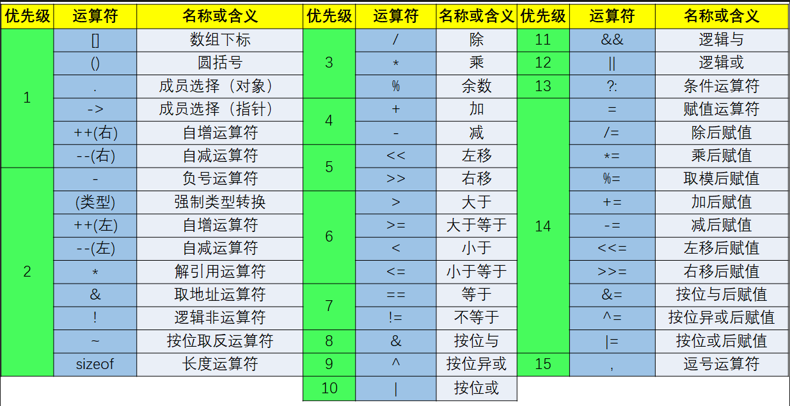

# 嵌入式学习 DAY 3

## 位运算
###    |:按位或
        两个数字的二进制对应的位置只要有1结果就是1，否则为0（有1则1）
示例：
```
    //练习1：大写转小写
    char ch1;
    while ((ch1 = getchar()) != '\n') {
        ch1 |= 0x20;
        printf("%c", ch1);
    }
```   
###    &:按位与
        两个数字的二进制对应的位置只要有0，结果就为0，否则为1（有0则0）

示例：
```
    //练习2：小写转大写
    char ch2;
    while ((ch2 = getchar()) != '\n') {
        ch2 &= ~0x20;
        printf("%c", ch2);
    }
```
###    ^:按位异或
        两个数字的二进制对应的位置数字如果相同，结果就为0，如果不同结果为1（同0异1）
示例：
```
    //练习3:大写转小写，小写转大写
    char ch3;
    while ((ch3 = getchar()) != '\n') {
        ch3 ^= 0x20;
        printf("%c", ch3);
    }
```
###    << 按位左移
        将一个数字的对应二进制的所有的位，向左侧移动一位，高位溢出，低位补零
        注意点：
            1、溢出的数字直接消失，不会再被找回来（高位溢出之后，不能再用右移取回）
            2、左移相当于将当前的数字 乘以 2^n，  比如说数字3，左移4位，就相当于 3 * 2^4


###    >> 按位右移
        将一个数字的对应二进制的所有位向右移动一位，低位溢出，高位补零
        右移相当于将当前的数字除以2^n，比如说数字10，右移2位，相当于10 / 2^2

###    ~按位取反
        将数字对应的二进制的各个位，进行取反，原来是0就换成1，原来是1就换成0
        比如：0000 1010(10)  取反 1111 0101（245）


###  原码、反码、补码

    原码：
    最高位是符号位，0表示正数，1表示负数

    反码：
    最高位是符号位，0表示正数，1表示负数，正数的反码等于它本身，负数的反码除了符号位以外，其余各位取反

    补码：
    最高位是符号位，0表示正数，1表示负数，正数的补码等于它本身，负数的补码是反码+1


    原码转补码：正数不变，负数除了符号位以外，其余各位取反+1
    补码转原码：正数不变，负数除了符号位以外，其余各位取反+1
    注：即数值位从右往左数第一个‘1’开始的左边全部取反。

按位运算符可以和赋值运算符放一起：
    |=、&=、<<=、>>=、^=、=

### 运算符优先级



## 左值右值

###    左值
        可以出现在赋值运算符左边的，也可以出现在赋值运算符的右边，标识了一个可以存储结果的地点（内存空间）
        程序在编译的时候，编译器会为每一个变量都分配一个地址，所以变量一般都是左值，地址在编译的时候是可知的。

###    右值
        出现在赋值运算符右边的，它必须有一个特定的值。
        在变量中存储的那个值，一般都是右值，只有在程序运行的时候才可知。
        右值是一个字面量或者一个数字或者一个常量，它在内存中并没有一个具体的地址

大多数表达式都具有右值的属性，因为每个变量所标识的空间地址都会存储一个具体的值，只要表达式不出错，那么它就会获取到一个特定的值。


## 类型转换
### 隐式类型转换
    从低等级到高等级的类型转换就是隐式类型转换，例如：int -> unsigned int、 long->unsigned long、float->double。
### 强制类型转换
    (类型说明符)(表达式)：一般后面是一个表达式的时候，需要加括号先计算表达式结果，再强转
    (类型说明符)变量/值：如果后面是一个变量或者一个具体的数字，可以加也可以不加，没有影响


## 选择语句
### if语句
    语法:
```
if (条件表达式) {
        执行语句;
} else if (条件表达式) {
    执行语句;
} ..... //中间以及最后的语句可有可无
 else {
    执行语句;
}
```

总结：
    if语句会自上而下进行判断，如果有已经成立的条件，不会继续向下判断了
    所有的分支都不成立的时候，去else
    else if  或者 else 不是必须的，依据实际的场景看是否需要


### switch语句
主要是对一个输入数据进行判等的操作。
语法：
```
switch(整型/枚举){
    case 常量1：
         执行语句；
         break；
    case 常量2：
         执行语句；
         break；
    case 常量3：
         执行语句；
         break；
    case 常量4：
         执行语句；
         break；
    ......
    default:
         执行语句；
}
```

执行思路：将switch括号中的值和每一个case后的常量值进行对比，如果都匹配的就执行相应的语句，否则就执行default
注意：
    每一个case后面都应该有一个break，为了防止穿透执行，如果没有break，当满足了某一个case之后，会持续向下执行case语句，直到遇到break或者整个switch语句结束为止。
    switch中的所有case后的常量值都不可以重复。

