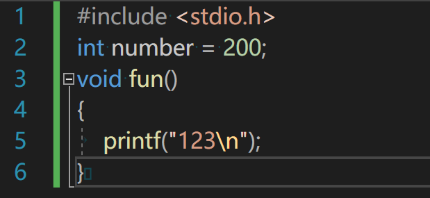
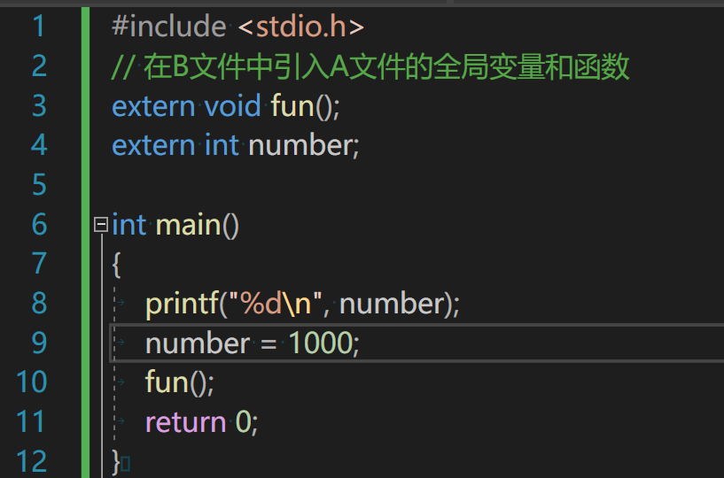

# 嵌入式学习 c语言基础: day8

# 二维数组

    作用：将一些可以当做表格处理的数据，更加适合存放在二维数组中处理。

    定义方式：数据类型 数组名[行数][列数];

        二维数组可以被认为是一维数组嵌套一维数组的形式，{{1,2,3},{4,5,6}}

# 指针数组

    概念：数组元素都是指针的数组就是指针数组。

    定义方式：类型名* 数组名[数组长度];

# 数组指针
## 概念：

指向整个数组的指针就是数组指针，本质是一个指针

## 定义方式：

类型名(*数组指针名)[数组指针长度];

# 宏定义的传参
##     概念
        宏定义是将代码中和宏名相同的内容，替换为宏名后的值

# 外部声明extern
    extern关键字可以扩展函数或者全局变量（函数外部的变量）的作用域扩展到别的文件中。
    A.c

    B.c

# 函数指针
    概念：保存函数地址的指针变量，可以叫做函数指针变量。
    定义语法：函数类型 (*函数指针名)(形参类型表);

